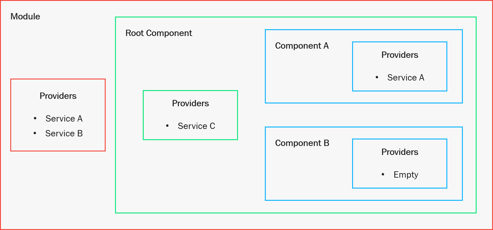

# Services

[Table of Contents](./toc.md)

* [Overview](#overview)
* [Service Scope](#service-scope)
* [Observables](#observables)
* [Core Services](#core-services)
    * [ObjectMapService](#objectmapservice)
    * [ThemeService](#themeservice)
    * [SnackerService](#snackerservice)
* [API Services](#api-services)
    * [ItemService](#itemservice)

## [Overview](#services)

The [Angular docs](https://angular.io/guide/architecture-services) say it best:

> *Service* is a broad category encompassing any value, function, or feature that an app needs. A service is typically a class with a narrow, well-defined purpose. It should do something specific and do it well.

As stated in the [Angular Overview](./08-angular-overview) article, Angular is a full front-end framework. One of the core tenants of this framework is the dependency injection system. A service is nothing more than a TypeScript class that is marked with the `@Injectable()` decorator. This decorator allows Angular to manage the lifetime of the class, and appropriately control access to the service within the component tree.

## [Service Scope](#services)

The `NgModule` and `Component` decorators contain a `providers` array. A TypeScript class marked with the `@Injectable()` decorator can be added to the `providers` array of an Angular Module or Component. This enables Angular to manage the following things:

* Access to the service
* When the service is created and destroyed

To access a service from the `providers` array, you simply inject it into the constructor of the component that should use it:

```ts
import { Component } from '@angular/core';
import { ExampleService } from '../../services';

@Component({
    selector: 'example',
    templateUrl: 'example.component.html',
    providers: [ ExampleService ]
})
export class ExampleComponent {
    constructor(
        public service: ExampleService
    ) { }
}
```

The dependency injection process can be explained looking at the following diagram:

[](./images/13.01-dependency-injection.png)

When a service is injected into the constructor of a component, it will perform the following steps:

* Check its own `providers` array for the requested service
    * If it is found, use that instance
* Traverse up the graph, searching the `providers` array for the requested service
    * The first instance it encounters is the instance that will be used
    * If no instance is available, an error is thrown

With this in mind, the following table expresses how the services in the diagram would be resolved for the components in the diagram:

Component | Service | Provider
----------|---------|---------
Component A | Service A | Component A
Component A | Service B | Module
Component A | Service C | Root Component
Component A | Service D | ***Error thrown!***
Component B | Service A | Module
Component B | Service B | Module
Component B | Service C | Root Component
Root Component | Service A | Module
Root Component | Service B | Module
Root Component | Service C | Root Component

With this in mind, it's important to understand that the state maintained by **Service A** in **Component B** and **Root Component** will be the same, while it will be different for **Component A**. 

* If **Service A** defines a `getItems()` function that populates an observable stream property, that property will be the same in **Component B** and **Root Component**: only one of the components would need to call `getItems()` for the stream to be populated for both components. 
* Conversely, **Component A** would need to call `getItems()` in order to populate the observable stream for its own instance of **Service A**.

## [Observables](#services)

> The explanation of RxJS Observables and Subjects in this section is intended to provide just enough information to understand how they work in the context of service state. RxJS will be covered in more detail in the [RxJS](./a2-rxjs.md) article.

An [**Observable**](https://rxjs.dev/guide/observable) is an asynchronous collection of future values or events. You subscribe to it once, and any time the value wrapped inside of the Observable is updated, the new value is delivered through the subscription.

A [**Subject**](https://rxjs.dev/guide/subject) is the mechanism that pushes a value or event to anything that is subscribed the affected Observable.

A [**BehaviorSubject**](https://rxjs.dev/api/index/class/BehaviorSubject) is a variant of **Subject** that requires an initial value and emits its current value whenever it is subscribed to.

I completely understand if none of this makes much sense. RxJS is a really difficult library to wrap your head around, and carries with it a ton of additional verbiage that, at first, feels impenetrable. The best way to learn RxJS is to just work with it.

Angular is built with [**Observables**](https://angular.io/guide/observables) at its foundation. Whenever you make an HTTP call in Angular, the result is returned to you as an Observable.

The intent of this section is to walk through how to use **BehaviorSubjects** in conjunction with their derived Observable streams to provide state management in Angular services. Hopefully after demonstrating how this works, it will alleviate some of the confusion and motivate you to take a deeper look at RxJS through the documentation linked in the [Links - Web Technologies](./r1-links#web-technologies) article.

In an Angular service, whenever you want to maintain the state of an object or collection, you define it as a `private BehaviorSubject<T>`. Only the service should be able to explicitly set the value wrapped inside of the Behavior Subject. You expose it as a read-only stream to your application using the `.asObservable()` method provided by Behavior Subject.

With this in mind, here is the general pattern for managing the state of a collection of items in a service:

```ts
import { Injectable } from '@angular/core';
import { HttpClient } from '@angular/common/http';
import { BehaviorSubject } from 'rxjs';
import { SnackerService } from './snacker.service';
import { Item } from '../models';

@Injectable()
export class ItemService {
    private items = new BehaviorSubject<Item[]>(null);

    items$ = this.items.asObservable();

    constructor(
        private http: HttpClient,
        private snacker: SnackerService
    ) { }

    getItems = () => this.http.get<Item[]>('/api/item/getItems')
        .subscribe(
            data => this.items.next(data),
            err => this.snacker.sendErrorMessage(err.error)
        );
}
```

Here are the important things to understand about this service:
* `items` is a `private` property of type `BehaviorSubject<Item[]>` with an initial value of `null`. We haven't retrieved any data yet, so the value wrapped inside of the Observable should reflect that.
* `items$` is a read-only Observable stream representation of the `items` Behavior Subject. Consumers of the service can call `items$.subscribe()` to listen for changes to the value of the stream, but they are unable to modify the value maintained by Behavior Subject. This is good, because you only want the **Service** to be able to manipulate the value. 
* The convention of adding `$` to the end of a property name, in this case `items$`, indicates that it is an Observable stream.
* `http.get<T>()` returns an Observable that wraps the return value of the function in a stream. Calling `http.get<T>()` does not do anything. It doesn't even make a call to Web API. Calling `.subscribe()` after is what triggers the function to execute.
* A `.subscribe()` call accepts three arguments:
    * `success` - a function that provides the value contained by the Observable when execution completes
    * `error` - a function that provides an error object when the Observable execution fails
    * `complete` - a function with no arguments that allows you to perform a task when the **Subject** of the Observable completes.
* Calling `this.items.next(data)` pushes the value of `data` into the `items` Behavior Subject, updating its value. Any listener that is subscribed to `items`, and consequently, the read-only `items$` Observable, will trigger the subscription and the listeners will have the updated data.

## [Core Services](#services)

Not all services are really complex and deal with managing state with Observables. As the introduction said, they should be small and serve a single purpose. There are three services built into the app stack that provide reusable functionality, and they will be demonstrated in the following sections.

> All of the services in this article are defined in the **services** module at **{Project}.Web\\ClientApp\\src\\app\\services**

### [ObjectMapService](#services)

If you recall from the [Models](./12-models.md) article, if you want an object received from Web API to truly be an instance of the class it corresponds to in Angular, you have to explicitly assign it to the object:

```ts
this.http.get<Item[]>('/api/item/getItems')
    .subscribe(
        data => this.items.next(data.map(x => Object.assign(new Item, x)))
    );
```

The `ObjectMapService` exists so that you can define four different types of functions related to TypeScript classes:

* Map an Object to an instance of a class
* Map a collection of objects to instances of a class
* Compare two instances of a class for equality
* Specify the property to track an instace of a class by

**`object-map.service.ts`**

```ts
import { Injectable } from '@angular/core';

@Injectable()
export class ObjectMapService {  
  // map - Use when receiving response from HTTP request
  // mapPerson = (person: Object): Person => Object.assign(new Person, person);
  
  // mapCollection - Use when receiving response from HTTP request
  // mapPeople = (people: Object[]): Person[] => people.map(this.mapPerson)

  // compareWith - Use when binding object value to MatSelect
  // comparePeople = (p1: Person, p2: Person) => p1 && p2 ? p1.id === p2.id : false;

  // trackBy - Use when iterating collection with NgFor
  // trackByPerson = (person: Person) => person.id;
}
```

Out of the box, it doesn't define any functionality, but is pre-populated with comments that show how it should work. If we go back to the `Item` class, we could add a `mapItem` function in here:

```ts
import { Injectable } from '@angular/core';

import { 
  Item
} from '../models';

@Injectable()
export class ObjectMapService {
  mapItem = (item: Object): Item => Object.assign(new Item, item);

  mapItems = (items: Object[]): Item[] => items.map(this.mapItem);
}
```

`ObjectMapService` is a global service, registered with the `providers` array of `AppModule`, so it can be injected into a service without having to register it. Now, we can make use of this in the HTTP call:

```ts
constructor(
  private mapper: ObjectMapService
) { }

getItems = () => this.http.get<Item[]>('/api/item/getItems')
    .subscribe(
        data => this.items.next(this.mapper.mapItems(data))
    )
```

The `compare` functions you can define deal with optimizing collections bound to a `MatSelect` component to keep it from keeping track of entire object graphs when detecting changes.

The `trackBy` functions you can define deal with optimizing `*ngFor` iterations when working with large collections, keeping it from tracking entire object graphs when detecting changes.

> These last two features will be demonstrated in the [Components](./14-components.md) and [Routes](./15-routes.md) articles.

### [ThemeService](#services)

The `ThemeService` deals with keeping track of the currently selected theme, and applying the theme to the app whenever it changes.

It's a pretty simple service. I'll show it here, then walk through what it does:

**`theme.service.ts`**

```ts
import { Injectable } from '@angular/core';
import { OverlayContainer } from '@angular/cdk/overlay';
import { BehaviorSubject } from 'rxjs';
import { Theme } from '../models';

@Injectable()
export class ThemeService {
  private themes = new BehaviorSubject<Theme[]>([
    { name: 'light-green', display: 'Light Green' },
    { name: 'dark-green', display: 'Dark Green' },
    { name: 'light-blue', display: 'Light Blue' },
    { name: 'dark-blue', display: 'Dark Blue' },
    { name: 'light-red', display: 'Light Red' },
    { name: 'dark-red', display: 'Dark Red' },
    { name: 'light-indigo', display: 'Light Indigo' },
    { name: 'dark-indigo', display: 'Dark Indigo' },
    { name: 'light-orange', display: 'Light Orange' },
    { name: 'dark-orange', display: 'Dark Orange' },
    { name: 'light-purple', display: 'Light Purple' },
    { name: 'dark-purple', display: 'Dark Purple' },
    { name: 'light-amber', display: 'Light Amber' },
    { name: 'dark-amber', display: 'Dark Amber' },
    { name: 'light-crimson', display: 'Light Crimson' },
    { name: 'dark-crimson', display: 'Dark Crimson' },
    { name: 'light-teal', display: 'Light Teal' },
    { name: 'dark-teal', display: 'Dark Teal' }
  ]);

  private theme = new BehaviorSubject<Theme>(this.themes.value[0]);

  themes$ = this.themes.asObservable();
  theme$ = this.theme.asObservable();

  constructor(
    private overlay: OverlayContainer
  ) {
    this.setOverlayContainerTheme(this.theme.value.name);
  }

  setTheme = (t: Theme) => {
    this.setOverlayContainerTheme(t.name, this.theme.value.name);
    this.theme.next(t);
  }

  setOverlayContainerTheme = (newTheme: string, oldTheme?: string) => {
    if (oldTheme) {
      this.overlay.getContainerElement().classList.remove(oldTheme);
    }
    this.overlay.getContainerElement().classList.add(newTheme);
  }
}
```

1. If you recall from the [Material - Material Themes](./11-material.md#material-themes) article, the custom theme infrastructure defines many themes. There are light and dark variants of themes composed of several palettes. The `themes` Behavior Subject captures a list of the themes the class name, as well as a display name.
2. A `theme` Behavior Subject is defined to keep track of the currently selected theme, which in this case, defaults to **Light Green**.
3. The `themes` and `theme` private properties are exposed as read-only Observable streams.
4. The constructor injects an `OverlayContainer` from the Angular Material library, which provides access to its class list. Any Material elements that are rendered outside of the *Root Component* (`AppComponent`) are rendered inside of an `OverlayContainer`. Adding the theme class to the class list will cause the `OverlayContainer` to apply your theme to these elements as well.
5. A `setTheme` function is provided with a `Theme` parameter, and updates the current app theme.
6. The `setOverlayContainerTheme` function is defined and accepts potentially two arguments: the new theme to be applied, and optionally the old theme to remove. If an `oldTheme` argument is provided, it is removed from the `OverlayContainer` instance. Then, the `newTheme` argument is added to the class list for the `OverlayContainer`. This function is called in both the constructor, and whenever the `setTheme` function is called.

> The implementation of this service will be described in the [Components](./14-components.md) article.

### [SnackerService](#services)  

The `SnackerService` is built around the [Snackbar](https://material.angular.io/components/snack-bar/overview) component in Angular Material. With it, you can send snackbar notifications to users. It specifies the default configuration for the `MatSnackBar` instance it uses, and has several functions for updating the configuration and showing different types of notifications.

You might have noticed in several service examples the following:

```ts
.subscribe(
    data => // do something
    err => this.snacker.sendErrorMessage(err.error)
)
```

This is all you need to do to send an error notification to a user, thanks to the `SnackerService`.

**`snacker.service.ts`**

```ts
import { Injectable } from '@angular/core';

import {
  MatSnackBar,
  MatSnackBarConfig
} from '@angular/material';

@Injectable()
export class SnackerService {
  private config = new MatSnackBarConfig();

  constructor(private snackbar: MatSnackBar) {
    this.config.duration = 5000;
    this.config.panelClass = [];
  }

  private sendMessage = (message: string) => this.snackbar.open(message, 'Close', this.config);

  setDuration(duration: number) {
    this.config.duration = duration;
  }

  setClasses = (classes: string[]) => {
    classes.push('snacker');
    this.config.panelClass = classes;
  }

  sendColorMessage = (message: string, colors: string[]) => {
    this.setClasses(colors);
    this.sendMessage(message);
  }

  sendErrorMessage = (message: string) => {
    this.setClasses(['snacker-red']);
    this.sendMessage(message);
  }

  sendWarningMessage = (message: string) => {
    this.setClasses(['snacker-orange']);
    this.sendMessage(message);
  }

  sendSuccessMessage = (message: string) => {
    this.setClasses(['snacker-green']);
    this.sendMessage(message);
  }
}
```

It's a pretty simple service (thanks to Angular Material), but is really handy. The primary functions you would use with it are:

* `sendErrorMessage`
* `sendWarningMessage`
* `sendSuccessMessage`

You can additionally send a custom colored message using `sendColorMessage`. When covering the theming section of the [Material](./11-material.md) article, I intentially left out the `material-snacker.scss` file because I wanted to demonstrate how it works here. All you need to do to add this style to the theme is `import` it in the `material-themes.scss` file (which is already done by default).

**`material-snacker.scss`**

```scss
@import './material-styles.scss';

div[class*="dark-"] snack-bar-container.mat-snack-bar-container.snacker {
  background-color: #3e3e3e!important;
}

div[class*="dark-"] simple-snack-bar.mat-simple-snackbar,
div[class*="dark-"] .snacker div.mat-simple-snackbar-action {
    color: #e1e1e1;
}

div[class*="dark-"] .snacker-red simple-snack-bar.mat-simple-snackbar {
    color: map-get($mat-red, 500);
}

div[class*="dark-"] .snacker-pink simple-snack-bar.mat-simple-snackbar {
    color: map-get($mat-pink, 200);
}

div[class*="dark-"] .snacker-purple simple-snack-bar.mat-simple-snackbar {
    color: map-get($mat-purple, A100);
}

div[class*="dark-"] .snacker-deep-purple simple-snack-bar.mat-simple-snackbar {
    color: map-get($mat-deep-purple, A100);
}

div[class*="dark-"] .snacker-indigo simple-snack-bar.mat-simple-snackbar {
    color: map-get($mat-indigo, A100);
}

div[class*="dark-"] .snacker-blue simple-snack-bar.mat-simple-snackbar {
    color: map-get($mat-blue, 500);
}

div[class*="dark-"] .snacker-light-blue simple-snack-bar.mat-simple-snackbar {
    color: map-get($mat-light-blue, A100);
}

div[class*="dark-"] .snacker-cyan simple-snack-bar.mat-simple-snackbar {
    color: map-get($mat-cyan, A200);
}

div[class*="dark-"] .snacker-teal simple-snack-bar.mat-simple-snackbar {
    color: map-get($mat-teal, A200);
}

div[class*="dark-"] .snacker-green simple-snack-bar.mat-simple-snackbar {
    color: map-get($mat-green, A400);
}

div[class*="dark-"] .snacker-light-green simple-snack-bar.mat-simple-snackbar {
    color: map-get($mat-light-green, A400);
}

div[class*="dark-"] .snacker-lime simple-snack-bar.mat-simple-snackbar {
    color: map-get($mat-lime, A400);
}

div[class*="dark-"] .snacker-yellow simple-snack-bar.mat-simple-snackbar {
    color: map-get($mat-yellow, A200);
}

div[class*="dark-"] .snacker-amber simple-snack-bar.mat-simple-snackbar {
    color: map-get($mat-amber, A200);
}

div[class*="dark-"] .snacker-orange simple-snack-bar.mat-simple-snackbar {
    color: map-get($mat-orange, A200);
}

div[class*="dark-"] .snacker-deep-orange simple-snack-bar.mat-simple-snackbar {
    color: map-get($mat-deep-orange, A200);
}

div[class*="dark-"] .snacker-brown simple-snack-bar.mat-simple-snackbar {
    color: map-get($mat-brown, 300);
}

div[class*="dark-"] .snacker-grey simple-snack-bar.mat-simple-snackbar {
    color: map-get($mat-grey, 300);
}

div[class*="dark-"] .snacker-blue-grey simple-snack-bar.mat-simple-snackbar {
    color: map-get($mat-blue-grey, 200);
}

div[class*="light-"] snack-bar-container.mat-snack-bar-container.snacker {
  background-color: #ffffff!important;
}

div[class*="light-"] simple-snack-bar.mat-simple-snackbar,
div[class*="light-"] .snacker div.mat-simple-snackbar-action {
    color: #3e3e3e;
}

div[class*="light-"] .snacker-red simple-snack-bar.mat-simple-snackbar {
  color: map-get($mat-red, 500);
}

div[class*="light-"] .snacker-pink simple-snack-bar.mat-simple-snackbar {
  color: map-get($mat-pink, A200);
}

div[class*="light-"] .snacker-purple simple-snack-bar.mat-simple-snackbar {
  color: map-get($mat-purple, A400);
}

div[class*="light-"] .snacker-deep-purple simple-snack-bar.mat-simple-snackbar {
  color: map-get($mat-deep-purple, A200);
}

div[class*="light-"] .snacker-indigo simple-snack-bar.mat-simple-snackbar {
  color: map-get($mat-indigo, A200);
}

div[class*="light-"] .snacker-blue simple-snack-bar.mat-simple-snackbar {
  color: map-get($mat-blue, 500);
}

div[class*="light-"] .snacker-light-blue simple-snack-bar.mat-simple-snackbar {
  color: map-get($mat-light-blue, A400);
}

div[class*="light-"] .snacker-cyan simple-snack-bar.mat-simple-snackbar {
  color: map-get($mat-cyan, A700);
}

div[class*="light-"] .snacker-teal simple-snack-bar.mat-simple-snackbar {
  color: map-get($mat-teal, A700);
}

div[class*="light-"] .snacker-green simple-snack-bar.mat-simple-snackbar {
  color: map-get($mat-green, A700);
}

div[class*="light-"] .snacker-light-green simple-snack-bar.mat-simple-snackbar {
  color: map-get($mat-light-green, A700);
}

div[class*="light-"] .snacker-lime simple-snack-bar.mat-simple-snackbar {
  color: map-get($mat-lime, A700);
}

div[class*="light-"] .snacker-yellow simple-snack-bar.mat-simple-snackbar {
  color: map-get($mat-yellow, A700);
}

div[class*="light-"] .snacker-amber simple-snack-bar.mat-simple-snackbar {
  color: map-get($mat-amber, A700);
}

div[class*="light-"] .snacker-orange simple-snack-bar.mat-simple-snackbar {
  color: map-get($mat-orange, A400);
}

div[class*="light-"] .snacker-deep-orange simple-snack-bar.mat-simple-snackbar {
  color: map-get($mat-deep-orange, A400);
}

div[class*="light-"] .snacker-brown simple-snack-bar.mat-simple-snackbar {
  color: map-get($mat-brown, 400);
}

div[class*="light-"] .snacker-grey simple-snack-bar.mat-simple-snackbar {
  color: map-get($mat-grey, 500);
}

div[class*="light-"] .snacker-blue-grey simple-snack-bar.mat-simple-snackbar {
  color: map-get($mat-blue-grey, 500);
}
```

There's really only four parts to the styles here:

* Set the background and default foreground color of `MatSnackBar` for dark themes
* Specify the shade of color to use for the foreground for each of the color classes for dark themes
* Set the background and default foreground color of `MatSnackBar` for light themes
* Specify the shade of color to use for the foreground for each of the color classes for light themes

Any color rule that you see here can be passed into `sendColorMessage` as the second argument, and it will render that color. The only difference between `sendColorMessage` and the other send functions is that the other functions do this for you.

**Example usage**

```ts
this.snacker.sendColorMessage(message, ['snacker-light-blue']);
```

## [API Services](#services)

Every **Controller** that you define in Web API on the back end should have a corresponding **Service** on the front end. The action methods defined in the controller should map to functions in the service. I refer to these services as API services, because their sole purpose is to interface with an API controller.

In addition to this rule, they should also specify properties for the data that they retrieve from Web API. Not one property for every function that retrieves data, just one property for every *type* of data retrieved.

To show why, the following section will build out an `ItemService` based on the `ItemController`.

One more rule that I should point out is that any function that executes a **POST** should return a `Promise<boolean>`. This allows you to use `async` / `await` in the calling component and determine whether the asynchronous call succeeded or failed, and to be able to respond accordingly.

For example:

``` ts
addItem = (item: Item): Promise<boolean> =>
  new Promise((resolve) => {
    this.http.post('/api/item/addItem', item)
      .subscribe(
        () => {
          this.snacker.sendSuccessMessage(`${item.name} successfully added`);
          resolve(true);
        },
        err => {
          this.snacker.sendErrorMessage(err.error);
          resolve(false);
        }
      )
  });
```

> `Promise` and `Promise<T>` in JavaScript / TypeScript is roughly equivalent to `Task` and `Task<T>` in C#. If you are unfamiliar with promises, I highly encourage you to check out the [Promise](https://developer.mozilla.org/en-US/docs/Web/JavaScript/Reference/Global_Objects/Promise) documentation.

Now, a component that calls this function can implement the following workflow:

```ts
addItem = async () => {
  const res = await this.itemService.addItem(this.item);

  res && this.reset();
}

reset = () => {
  this.item = new Item();
  this.itemService.getItems();
}
```

### [ItemService](#services)

With these rules established, we can deduce that only two property streams are needed for the data that is retrieved from `ItemController`:

* `items`, and the public `items$` stream
* `item`, and the public `item$` stream

Although there are four different **GET** methods for retrieving a collection of data, they all return the same data type. Using dependency injection, we can ensure that components don't step on each others toes when calling a function that updates the `items$` stream.

If you have an `ItemBinComponent` that's responsible for rendering deleted `Item` objects, and it is opened from an `ItemListComponent` that renders all available items, each should have their own instance of `ItemService` to track the state of the items that have been retrieved.

Now that all of the rules and caveats are out of the way, the `ItemService` should be pretty straight forward.

**`item.service.ts`**

```ts
import { Injectable } from '@angular/core';
import { HttpClient } from '@angular/common/http';
import { BehaviorSubject } from 'rxjs';
import { ObjectMapService } from './object-map.service';
import { SnackerService } from './snacker.service';
import { Item } from '../models';

@Injectable()
export class ItemService {
  private items = new BehaviorSubject<Item[]>(null);
  private item = new BehaviorSubject<Item>(null);

  items$ = this.items.asObservable();
  item$ = this.item.asObservable();

  constructor(
    private http: HttpClient,
    private mapper: ObjectMapService,
    private snacker: SnackerService
  ) { }

  getItems = () => this.http.get<Item[]>('/api/item/getItems')
    .subscribe(
      data => this.items.next(this.mapper.mapItems(data)),
      err => this.snacker.sendErrorMessage(err.error)
    );

  getDeletedItems = () => this.http.get<Item[]>('/api/item/getDeletedItems')
    .subscribe(
      data => this.items.next(this.mapper.mapItems(data)),
      err => this.snacker.sendErrorMessage(err.error)
    );

  searchItems = (search: string) => this.http.get<Item[]>(`/api/item/searchItems/${search}`)
    .subscribe(
      data => this.items.next(this.mapper.mapItems(data)),
      err => this.snacker.sendErrorMessage(err.error)
    );

  searchDeletedItems = (search: string) => this.http.get<Item[]>(`/api/item/searchDeletedItems/${search}`)
    .subscribe(
      data => this.items.next(this.mapper.mapItems(data)),
      err => this.snacker.sendErrorMessage(err.error)
    )

  getItem = (id: number) => this.http.get<Item>(`/api/item/getItem/${id}`)
    .subscribe(
      data => this.item.next(this.mapper.mapItem(data)),
      err => this.snacker.sendErrorMessage(err.error)
    );

  addItem = (item: Item): Promise<boolean> =>
    new Promise((resolve) => {
      this.http.post('/api/item/addItem', item)
        .subscribe(
          () => {
            this.snacker.sendSuccessMessage(`${item.name} successfully added`);
            resolve(true);
          },
          err => {
            this.snacker.sendErrorMessage(err.error);
            resolve(false);
          }
        )
    });

  updateItem = (item: Item): Promise<boolean> =>
    new Promise((resolve) => {
      this.http.post('/api/item/updateItem', item)
        .subscribe(
          () => {
            this.snacker.sendSuccessMessage(`${item.name} successfully updated`);
            resolve(true);
          },
          err => {
            this.snacker.sendErrorMessage(err.error);
            resolve(false);
          }
        )
    });

  toggleItemDeleted = (item: Item): Promise<boolean> =>
    new Promise((resolve) => {
      this.http.post('/api/item/toggleItemDeleted', item)
        .subscribe(
          () => {
            const msg = item.isDeleted ?
              `${item.name} restored` :
              `${item.name} sent to the recycle bin`;

            this.snacker.sendSuccessMessage(msg);
            resolve(true);
          },
          err => {
            this.snacker.sendErrorMessage(err.error);
            resolve(false);
          }
        )
    });

  removeItem = (item: Item): Promise<boolean> =>
    new Promise((resolve) => {
      this.http.post('/api/item/removeItem', item)
        .subscribe(
          () => {
            this.snacker.sendSuccessMessage(`${item.name} permanently deleted`);
            resolve(true);
          },
          err => {
            this.snacker.sendErrorMessage(err.error);
            resolve(false);
          }
        )
    });
}
```

Aside from the **Observable** properties and injected services, it just contains functions that map the `ItemController` action methods. All of the **GET** functions call an API endpoint, then push the returned data into a stream. All of the **POST** functions receive an `Item` instance, return a `Promise<boolean>`, and make pass the `Item` to an API endpoint. If it returns successfully, the user is notified and the **Promise** resolves `true`. If an error occurred, the user is notified and the **Promise** resolves `false`.

[Back to Top](#services)