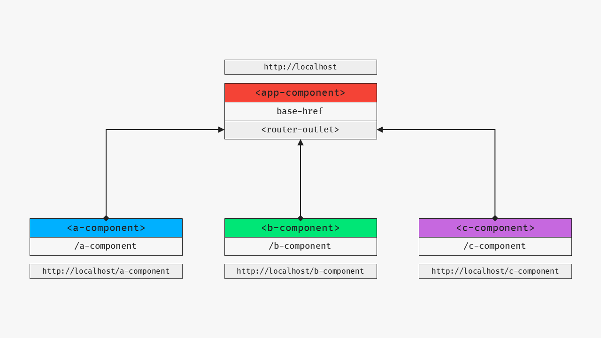
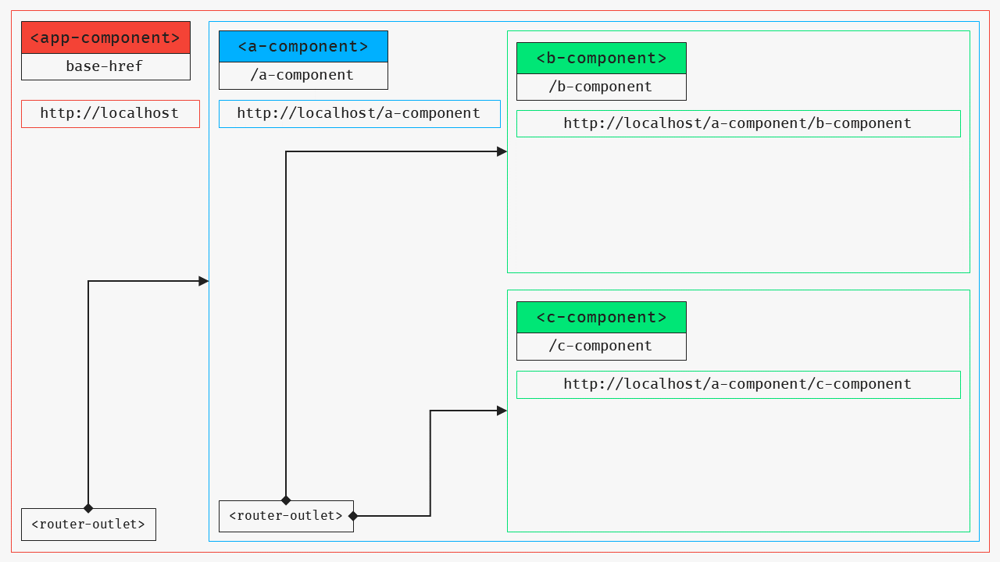

# Advanced Routing  

**Child Routes**  
https://angular.io/guide/router#a-crisis-center-with-child-routes  

**Secondary Routes**  
https://angular.io/guide/router#displaying-multiple-routes-in-named-outlets  

[Table of Contents](./toc.md)

* [Overview](#overview)
    * [base-href](#base-href)
    * [router-outlet](#router-outlet)
    * [Router Links](#router-links)
    * [Active Router Links](#active-router-links)
    * [Route Parameters](#route-parameters)
    * [Activated Route](#activated-route)
    * [Routing Example](#routing-example)
* [Child Routes](#child-routes)
    * [Child Routes Example](#child-routes-example)
* [Secondary Routes](#secondary-routes)
    * [Secondary Routes Example](#secondary-routes-example)

## [Overview](#advanced-routing)

The [routes](./17-routes.md) article provided a quick and dirty introduction to routing in Angular in the context of building and configuring route components. This article will take things a step further and provide a more detailed look at the routing infrastructure, as well as some of the advanced routing techniques you can use to manage more complex view states.

To understand how routing works, it helps to visualize what the Angular router actually does when it resolves a route.

[](./images/a2-advanced-routing/routing.png)

Consider the following route definitions:

```ts
const routes: Routes = [
    { path: 'a-component', component: AComponent },
    { path: 'b-component', component: BComponent },
    { path: 'c-component', component: CComponent },
    { path: '', redirectTo: 'a-component', pathMatch: 'full' },
    { path: '**', redirectTo: 'a-component', pathMatch: 'full' }
];
```

> For more details on configuring routes, see the [define routes](https://angular.io/guide/router#define-routes) section in the documentation.

The order in which the routes are defined are important. If the first route parameter resolves to any of the first three defined routes, it will load the specified component at the `<router-outlet>` specified in the `AppComponent` template.

The fourth route specifies that no URL parameter is present, so if none is encountered, it will re-direct to `/a-component`, making it the default route.

The fifth route is a catch-all route. It specifies any URL parameter other than what has been defined and, if encountered, re-directs to `/a-component`. It is important that this is defined last. If it were defined before any of the other routes, it would prevent those routes from ever being resolved.

### [base-href](#advanced-routing)

In the `<head>` element of [index.html](./template/Qxyz.Web/ClientApp/src/index.html), a `<base href="/">` is defined.  

Per the Angular deployment guide:  
> `<base href="/">` specifies a base path for resolving relative URLs to assets such as images, scripts, and style sheets. During navigation, the Angular router uses the *base href* as the base path to component, template, and module files.

Because the **app** folder is located in the same directory as **index.html**, the base path is set as `<base href="/">`.

See [the base tag](https://angular.io/guide/deployment#the-base-tag) for more details.

### [router-outlet](#advanced-routing)

The `<router-outlet>` specifies where components that are resolved from a route should be loaded into a view.

If `<a-component>` is resolved, it would be rendered as follows:

**Example AppComponent Template**
```html
<mat-toolbar>Header</mat-toolbar>
<section>
  <router-outlet></router-outlet>
  <!-- resolved routes render here -->
  <a-component></a-component>
</section>
```

> See [router outlet](https://angular.io/guide/router#router-outlet) for more details.

### [Router Links](#advanced-routing)

Routes can be linked to using the `routerLink` directive. An `<a>` tag does not necessarily need to be used for linking to an Angular route. Any element that can be clicked and and defines a `routerLink` directive is eligible for linking to routes.

All of the following are valid:

```html
<!-- An anchor tag -->
<a routerLink="/a-component">A Component</a>

<!-- A button -->
<button routerLink="/a-component">A Component</a>

<!-- A container for more complex UI -->
<section routerLink="/a-component">
  <p>A Component</p>
</section>
```

> See [router links](https://angular.io/guide/router#router-links) for more details.

### [Active Router Links](#advanced-routing)

Specifying a `routerLinkActive="class"` will toggle the css class for an active router link. Consider the following:

```html
<nav>
  <a routerLink="/a-component" routerLinkActive="active">A Component</a>
  <a routerLink="/b-component" routerLinkActive="active">B Component</a>
  <a routerLink="/c-component" routerLinkActive="active">C Component</a>
</nav>
```

If the current route is `/a-component`, then the first `<a>` would have the `.active` class added to it. This means that you can style the links to indicate what the current route is:

```css
a.active {
    // styles for the active anchor
}
```

> See [active router links](https://angular.io/guide/router#active-router-links) for more details.

### [Route Parameters](#advanced-routing)

To specify routes with parameters that could have multiple values, an object ID or name for instance, the route is defined as:

```ts
{ path: 'object/:name', component: ObjectComponent }
```

This would create a route definition that can be resolved as `http://localhost/object/some-name`, where the `name` parameter in the router would be `some-name`.

To define a `routerLink` that resolves to a route with a dynamic parameter:

```html
<a [routerLink]="['/object', object.name]">{{object.name}}</a>
```

> See [route parameters](https://angular.io/guide/router#route-parameters) for more details.

### [Activated Route](#advanced-routing)

To retrieve a URL parameter from the current route, the `ActivatedRoute` router service should be injected into the route component. The `paramMap` Observable can then be subscribed for access to URL parameters. For instance, if you need to retrieve the `name` parameter from the example above:

```ts
constructor(
    private route: ActivatedRoute
) { }

ngOnInit() {
    this.route.paramMap.subscribe((param: ParamMap) => {
        if (param.has('name')) {
            const name = param.get('name');
            // do something with name
        }
    });
}
```

> See [activated route](https://angular.io/guide/router#activated-route) for more details.

### [Routing Example](#advanced-routing)

* [StackBlitz - Demo](https://docs-basic-routing.stackblitz.io)
* [StackBlitz - Source](https://stackblitz.com/edit/docs-basic-routing)

This section will walk through all of the relevant parts of the example.

`<router-outlet>` is defined in [app.component.html](https://stackblitz.com/edit/docs-basic-routing?file=src%2Fapp%2Fapp.component.html) on line **29**.

Route components are defined in the **/src/app/routes** directory, and all of the app routes are defined in [index.ts](https://stackblitz.com/edit/docs-basic-routing?file=src%2Fapp%2Froutes%2Findex.ts).

All of the sidebar links are defined in [sidebard.component.html](https://stackblitz.com/edit/docs-basic-routing?file=src%2Fapp%2Fcomponents%2Fsidepanel%2Fsidepanel.component.html) as [PanelLinkComponent](https://stackblitz.com/edit/docs-basic-routing?file=src%2Fapp%2Fcomponents%2Fsidepanel%2Fpanel-link.component.html) elements.

Active sidepanel links are styled in [material-styles.scss](https://stackblitz.com/edit/docs-basic-routing?file=src%2Ftheme%2Fmaterial-styles.scss) as part of the `style-theme` mixin. See line **75**.

Clicking an **Item** in the [HomeComponent](https://stackblitz.com/edit/docs-basic-routing?file=src%2Fapp%2Froutes%2Fhome%2Fhome.component.html) will navigate to `/item/:id`. The [ItemComponent](https://stackblitz.com/edit/docs-basic-routing?file=src%2Fapp%2Froutes%2Fitem%2Fitem.component.ts) retrieves the `id` URL parameter, and retrieves the corresponding `Item`, to be rendered in [item.component.html](https://stackblitz.com/edit/docs-basic-routing?file=src%2Fapp%2Froutes%2Fitem%2Fitem.component.html).

## [Child Routes](#advanced-routing)

> For additional details on child routes, see [Milestone 4 - Crisis center feature](https://angular.io/guide/router#milestone-4-crisis-center-feature) in the Angular router documentation.

A child route can be defined by specifying a list of `Route` objects in the `children` array of a `Route`. The component resolved to the route with `children` must define a `<router-outlet>` in its template. This ensures that components resolved at its child routes can be rendered.

Again, it helps to visualize this to understand it better:

[](./images/a2-advanced-routing/child-routes.png)

There are two different ways you can go about setting up this route configuration.

**One Route Module**

**index.ts**

```ts
export const Routes: Route[] = [
    {
        path: 'a-component',
        component: AComponent,
        children: [
            { path: 'b-component', component: BComponent },
            { path: 'c-component', component: CComponent },
            { path: '', redirectTo: 'b-component', pathMatch: 'prefix' },
            { path: '**', redirectTo: 'b-component', pathMatch: 'prefix' }
        ]
    },
    { path: '', redirectTo: 'a-component', pathMatch: 'full' },
    { path: '**', redirectTo: 'a-component', pathMatch: 'full' }
]
```

Just as with the base routes, child routes can defined a default route, and a catch-all route. The difference is that the `pathMatch` property should be set to `prefix` instead of `full`. This ensures that routes are only evaluated in the context of the route the children are defined in.

**Multiple Route Modules**

If you start to have a lot of child routes, you can define the folder containing the route with the child routes as a TypeScript module, and define the child routes in a sub-folder. For example:

* routes
    * a
        * children
            * b.component.html
            * b.component.ts
            * c.component.html
            * c.component.ts
        * a.component.html
        * a.component.ts
        * index.ts
    * index.ts

In this situation, `/routes/a/index.ts` would be defined as follows:

```ts
import { Route } from '@angular/router';
import { BComponent } from './children/b.component';
import { CComponent } from './children/c.component';

export const AComponents = [
    BComponent,
    CComponent
];

export const ARoutes: Route[] = [
    { path: 'b-component', component: BComponent },
    { path: 'c-component', component: CComponent },
    { path: '', redirectTo: 'b-component', pathMatch: 'prefix' },
    { path: '**', redirectTo: 'b-component', pathMatch: 'prefix' }
];
```

Then, `/routes/index.ts` would import the child components, and define the child routes as follows:

```ts
import { Route } from '@angular/router';
import { AComponent } from './a/a.component';
import {
    AComponents,
    ARoutes
} from './a';

export const RouteComponents = [
    AComponent,
    ...AComponents
];

export const Routes: Route[] = [
    { path: 'a-component', component: AComponent, children: ARoutes },
    { path: '', redirectTo: 'a-component', pathMatch: 'full' },
    { path: '**', redirectTo: 'a-component', pathMatch: 'full' }
];
```

This helps to keep the app more organized and prevent `/routes/index.ts` from becoming too bulky.

### [Child Routes Example](#advanced-routing)

## [Secondary Routes](#advanced-routing)

### [Secondary Routes Example](#advanced-routing)

[Back to Top](#advanced-routing)