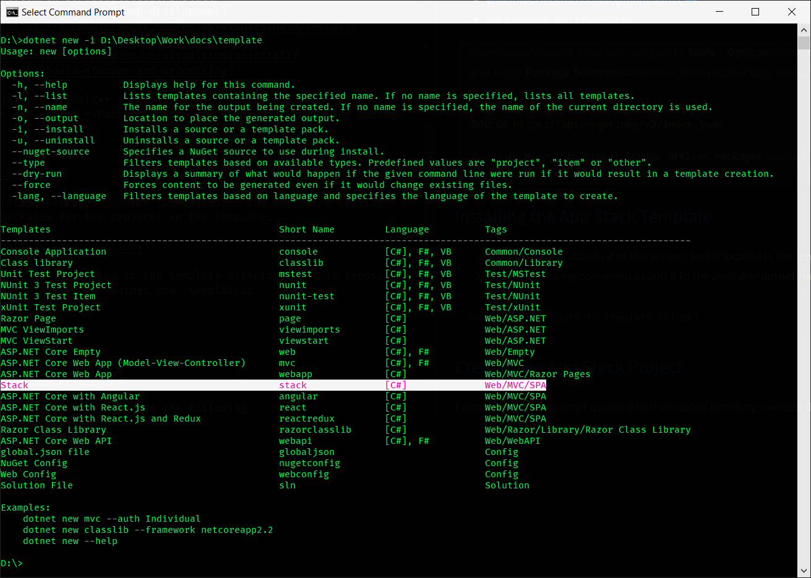

# Patterns and Practices  

[Table of Contents](./toc.md)

* [Format](#format)
* [Prerequisites](#prerequisites)
* [Overview](#overview)
* [Visual Studio Code Extensions](#visual-studio-code-extensions)
* [Visual Studio](#visual-studio)
* [Installing the App Stack Template](#installing-the-app-stack-template)
* [Creating an App Stack Project](#creating-an-app-stack-project)
* [Building and Running](#building-and-running)


## [Format](#patterns-and-practices)  

Throughout this documentation, each major section will be linked at the top of the article. Clicking the header of each major section will bring you back to the top of this article.  

Anywhere you see something referenced inside curly braces, i.e. - `{value}`, this means that the value isn't specific to the documentation and could be something that you come up with on your own. For example, a project name, a directory, etc.

## [Prerequisites](#patterns-and-practices)  

Before starting, ensure the following are installed and configured

Software | Notes | Mandatory?
---------|-------|-----------
[Node.js](https://nodejs.org/en/) | N/A | Yes
[Git](https://git-scm.com/) | CLI-based source control software | Yes
[Yarn](https://yarnpkg.com/en/) | Optimized client-side package manager | Yes
[.NET Core SDK](https://dotnet.microsoft.com/download) | SDK and Runtime for .NET Core | Yes
[Visual Studio Code](https://code.visualstudio.com/) | Robust text editor that works really well with .NET and Angular | Yes
[Visual Studio](https://visualstudio.microsoft.com/vs/) | IDE optimized for <span>.NET</span> development | Yes

## [Overview](#patterns-and-practices)  

> The following provides an overview of the app stack. Greater detail of the configuration and capabilities of each part will be covered in their relevant sections throughout the documentation.  

> All of the links throughout this guide, as well as some additional helpful links, are provided in [References - Links](./r1-links.md).

The current app stack is based on the `dotnet new angular` template provided by the [.NET Core SDK](https://docs.microsoft.com/en-us/dotnet/core/tools/dotnet-new).

The major modifications are as follows:
* Removed Angular testing infrastructure
* Removed unnecessary dependencies, including Bootstrap
* Removed demo app resources
* Added additional capabilities to the <span>ASP.NET</span> Core infrastructure
* Configured JSON Serialization settings
* Implemented Angular Material and provided an initial theming framework
* Created modular infrastructure for conventional file structure based on Angular resource types
    * Components
    * Dialogs
    * Services
    * Modules
    * Pipes
    * Routes

## [Visual Studio Code Extensions](#patterns-and-practices)  

Extension | Description | Mandatory?
----------|-------------|-----------
Angular Language Service | Editor services for Angular templates | Yes
C# | C# debugging support for Visual Studio Code | Yes
Debugger for Chrome | Debug JavaScript code in the Chrome browser | Yes
EditorConfig for VS Code | EditorConfig Support for VS Code | Yes
IntelliSense for CSS class names in HTML | CSS class name completion for the HTML class attribute based on the definitions found in your workspace | Yes
Node.js Modules Intellisense | Autocompletes Node.js modules in import statements | Yes
SCSS Formatter | A Visual Studio Code Extension to format SCSS | Yes
Settings Sync | Synchronize Settings, Snippets, Themes, File Icons, Launch, Keybindings, Workspaces and Extensions Across Multiple Machines Using GitHub Gist | Recommended
TSLint | TSLint for Visual Studio Code | Yes  

> For info on customizing and using Visual Studio Code, please refer to the [official documentation](https://code.visualstudio.com/docs)  

## [Visual Studio](#patterns-and-practices)  

There are 3 reasons why I install Visual Studio:  
1. Installing and managing SQL Server Express
2. Installing the C++ Build Tools needed for compiling Sass
3. Debugging in IIS  

The more I've worked with the new `dotnet` command line tools and Visual Studio Code, I've found myself returning to Visual Studio less and less. It's still useful incredibly useful, and you may prefer it more. This documentation will focus on a CLI-driven workflow and Visual Studio Code outside of the above-mentioned use cases.  

Only the following [**workloads**](https://visualstudio.microsoft.com/vs/visual-studio-workloads/) are needed in order to support the above-mentioned capabilities:  
* [Web development](https://docs.microsoft.com/en-us/visualstudio/install/workload-component-id-vs-community?view=vs-2019#aspnet-and-web-development)
* [Windows Desktop Development with C++](https://docs.microsoft.com/en-us/visualstudio/install/workload-component-id-vs-community?view=vs-2019#desktop-development-with-c)
* [Data storage and processing](https://docs.microsoft.com/en-us/visualstudio/install/workload-component-id-vs-community?view=vs-2019#data-storage-and-processing)

> After Visual Studio is installed, navigate to **Tools** > **Options** (from the top menu in Visual Studio). Expand **NuGet Package Manager** and select **Package Sources**. Ensure the following package source is available:  
> 
> **Name**: `nuget.org`  
> **Source**: `https://api.nuget.org/v3/index.json`  
> 
> If only the `Microsoft Visual Studio Offline Packages` source is available, the following sections will fail to restore the declared NuGet packages for the projects in the template.

## [Installing the App Stack Template](#patterns-and-practices)  

1. The template is attached ot this project and is located in the template directory of this repository
2. Run the following command to add it to the available `dotnet new` templates:

```
dotnet new -i {path-to-template-folder}
```  

After the command executes, the list of available `dotnet` commands is displayed, along with an updated list of available `dotnet new` templates. The following should closely represent what you see, with the new **stack** template highlighted:

[](./images/readme.01-new-template.png)

## [Creating an App Stack Project](#patterns-and-practices)  

From a command prompt resolved to the created directory, execute the following:

```
dotnet new stack -n {ProjectName} -o {ProjectName}
```  

> Make sure your project name is not written in **`kebab-casing`**! It is recommended that you use **`PascalCasing`** for the project name to avoid [solution project-resolution issues](https://github.com/JaimeStill/PatternsAndPractices/issues/35).  

## [Building and Running](#patterns-and-practices)  

Once the project has been created, run the following sequence of commands:  

```
{Project}>dotnet build
{Project}>cd {Project}.Web
{Project}.Web>dotnet run
```  

When the `dotnet run` command is called, the server will spin up at http://localhost:5000, and the Angular app will compile.

[Back to Top](#patterns-and-practices)